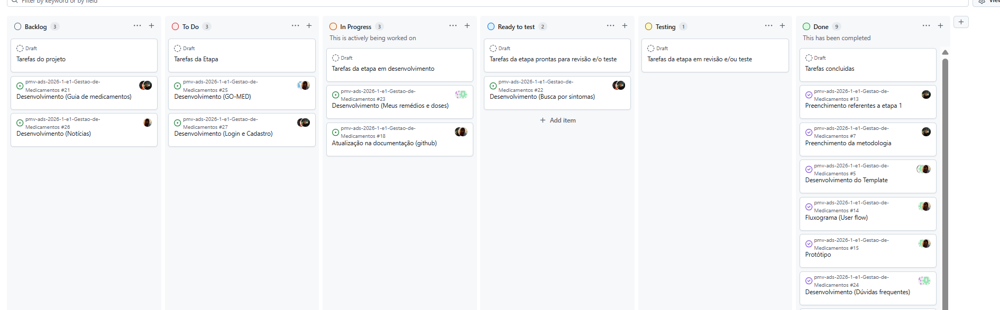

# Metodologia

## Gerenciamento de Projeto
A metodologia ágil escolhida para o desenvolvimento deste projeto foi o SCRUM, pois como citam Amaral, Fleury e Isoni (2019, p. 68), seus benefícios são a

“visão clara dos resultados a entregar; ritmo e disciplina necessários à execução; definição de papéis e responsabilidades dos integrantes do projeto (Scrum Owner, Scrum Master e Team); empoderamento dos membros da equipe de projetos para atingir o desafio; conhecimento distribuído e compartilhado de forma colaborativa; ambiência favorável para crítica às ideias e não às pessoas.”

### Divisão de Papéis

A equipe utiliza o Scrum como base para definição do processo de desenvolvimento.

- Scrum Master: Pedro Henrique Santos de Oliveira
- Product Owner: Luiz Gustavo Pereira de Melo
- Equipe de Desenvolvimento: Ashley Alexo da Silva, Felipe Alves Rodrigues, Luiz Gustavo Pereira de Melo, Pedro Augusto Pereira dos Santos e Pedro Henrique Santos de Oliveira
- Equipe de Design: Pedro Henrique Santos de Oliveira, Felipe Alves Rodrigues e Luiz Gustavo Pereira de Melo

### Processo

A equipe utiliza o Scrum como framework ágil para garantir entregas incrementais e alinhadas às necessidades dos usuários. A gestão visual e o fluxo de trabalho são operacionalizados através do GitHub Projects. A implementação segue o fluxo descrito abaixo, estruturado em colunas para garantir transparência e qualidade em cada etapa do desenvolvimento:

 - Backlog: Repositório central (Product Backlog) contendo todos os requisitos, ideias e melhorias mapeadas para o projeto.

 - To Do: Lista de tarefas selecionadas para a etapa atual (Sprint Backlog), já distribuídas entre os membros da equipe.

 - In Progress: Tarefas em execução técnica, abrangendo desenvolvimento de código, design ou documentação.

 - Ready to Test: Itens concluídos pelo desenvolvedor que aguardam o início da validação por outro integrante.

 - Testing: Fase de revisão e testes funcionais. Caso sejam identificadas falhas, a tarefa retorna para ajuste antes da aprovação final.

 - Done: Tarefas totalmente finalizadas que cumprem todos os critérios de qualidade e estão prontas para entrega.

### Etiquetas

As tarefas são, ainda, etiquetadas em função da natureza da atividade e seguem o seguinte esquema de cores/categorias:

<ul>
  <li>Bug (Erro no código)</li>
  <li>Desenvolvimento (Development)</li>
  <li>Documentação (Documentation)</li>
  <li>Gerência de Projetos (Project Management)</li>
  <li>Infraestrutura (Infrastructure)</li>
  <li>Testes (Tests)</li>
  <li>Adicionar (Add)</li>
</ul>

<figure> 
  
    <figcaption>Figura 3 - Tela do esquema de cores e categorias</figcaption>
</figure> 
  
### Ferramentas

- Editor de código
- Ferramentas de comunição
- Ferramenta de Edição de telas

O editor de código foi escolhido pela versatilidade. As ferramentas de comunicação utilizadas são integradas de forma simples fazendo com que todos tenham fácil acesso e manuseiod. Enfim, para edição de telas utilizamos uma ferramenta que combinasse com o nosso cotidiano.

Os artefatos do projeto são desenvolvidos a partir de diversas plataformas e a relação dos ambientes com seu respectivo propósito é apresentada na tabela que se segue.

| AMBIENTE                            | PLATAFORMA                         | LINK DE ACESSO                         |
|-------------------------------------|------------------------------------|----------------------------------------|
| Repositório de código fonte         | GitHub                             | http://github.com/ICEI-PUC-Minas-PMV-ADS/pmv-ads-2026-1-e1-proj-web-t7-pmv-ads-2026-1-e1-projdoctor                            |
| Documentos do projeto               | GitHub                             | http://github.com/ICEI-PUC-Minas-PMV-ADS/pmv-ads-2026-1-e1-proj-web-t7-pmv-ads-2026-1-e1-projdoctor/tree/main/documentos     |
| Projeto de Interface                | Canva                              | http://canva.link/5arlx58solzjxvo                       |
| Gerenciamento do Projeto            | GitHub Projects                    | http://github.com/orgs/ICEI-PUC-Minas-PMV-ADS/projects/2832                             |

### Estratégia de Organização de Codificação 

Todos os artefatos relacionados a implementação e visualização dos conteúdos do projeto do site são inseridos na pasta [codigo-fonte](https://github.com/ICEI-PUC-Minas-PMV-ADS/WebApplicationProject-Template-v2/tree/main/codigo-fonte).
