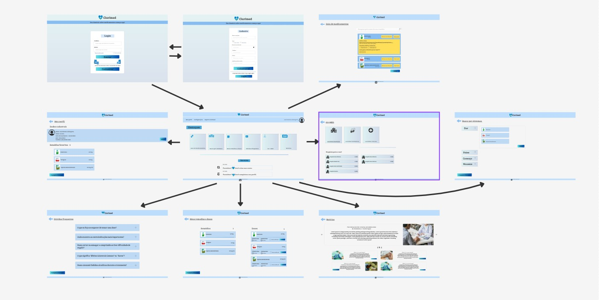

# Projeto de Interface

## User Flow

O Fluxograma apresentado na figura 1 mostra o fluxo de interação do usuário pelas telas do sistema. Cada uma das telas deste fluxo é detalhada na seção de Protótipo de baixa fidelidade que se segue. Para visualizar o protótipo interativo, acesse o [Fluxograma do Projeto](img/userflow.jpeg).

<figure> 
  <figcaption>Figura 1 - Fluxograma
</figure> 
   
 ## Protótipo de baixa fidelidade

As telas do sistema apresentam uma estrutura comum que é apresentada na figura 2. Nesta estrutura existem 3 grandes blocos, descritos a seguir. São eles:
<ul>
  <li>Cabeçalho - local onde estão dispostos o nome da aplicação web e navegação principal do site (menu da aplicação);</li>
  <li>Conteúdo - apresenta o conteúdo da tela em questão;</li>
  <li>Rodapé - apresenta informações sobre os direitos autorais.</li>
</ul>

<figure> 
  
</figure> 

<figure> 
  <figcaption>Figura 2 - Protótipo
</figure> 

<h3><b>Tela - Inicial sem Login</b></h3>

A Tela Inicial sem o login do usuário apresenta banners que remetem para as subpaginas como Guia de Medicamentos, Diagnóstico Prévio, Meus Remédios, Minhas Doses, Localizar Farmáciais/Hospitais e Acessar as Noticias. 

 
<figure> 
  <figcaption>Figura 3 - Tela inicial sem login
</figure> 

<h3><b>Tela - Login</b></h3>

A Tela de Login apresenta campos para a inserção do número de telefone e senha.

  

 
<figure> 
  <figcaption> Figura 4 - Tela de Login
</figure> 

<h3><b>Tela – Cadastro</b></h3>

A tela de cadastro apresenta os seguintes campos para a inserção das informações pessoais do usuário: Nome Completo, Sexo, Telefone, Data de Nascimento, Senha e Confirmação de Senha.

  

 
<figure> 
    <figcaption>Figura 5 - Tela de cadastro de usuários
</figure>

 

 
  <h3><b>Tela – Perfil</b></h3>

A tela de Perfil permite ter acesso às informações do usuário (que foram inseridas na Página de Cadastro), às telas de Cadastro de Remédios Favoritados, aopção de configurações e à opção de Retornar a página inicial.

 
<figure> 
    <figcaption>Figura 6 - Tela de Perfil
</figure>

   <h3><b>Tela – Dúvidas frequentes </b></h3>
 
A tela de duvidas frequentes permite ao úsuario ter acesso as perguntas mais relevantes sobre o site e suas funcionalidades.

  
 
  
 <figure> 
     <figcaption>Figura 7 - Dúvidas frequentes
 </figure>
 

  <h3><b>Tela – Guia de medicamentos</b></h3>

A Tela de Guia de Medicamentos apresenta os medicamentos que o usuario tem interesse de obter informações, a tela também fornece a opção de retornar ao menu anterior.

 
<figure> 
    <figcaption>Figura 8 - Tela de Guia de Medicamentos
</figure>
 

  <h3><b>Tela – meus rémedios e doses</b></h3>

A Tela de Minhas Doses apresenta os medicamentos que o usuario sinalizou que faz uso, junto de suas informações, a tela também fornece a opção de retornar ao menu anterior.

 
<figure> 
    <figcaption>Figura 9 - Meus rémerios e doses
</figure>
 

 <h3><b>Tela – Busca por Sintomas</b></h3>

A Tela de Busca por sintomas disponibiliza caixas de sintomas comuns em que o úsuario deve clicar ao indetificar-se, clicando ele terá as opçõpes de medicamentos para cada tipo de sintoma, a tela também fornece a opção de retornar ao menu anterior.

  

 
<figure> 
    <figcaption>Figura 10 - Busca por sintomas
</figure>
 

 <h3><b>Tela – Notícias</b></h3>

A tela de Notícias disponibiliza acesso a caixas de noticias com vinculação a links externos, a tela também fornece a opção de retornar ao menu anterior.

 
<figure> 
    <figcaption>Figura 11 - Notícias
</figure>
 

 <h3><b>Tela – GO - MED</b></h3>

A Tela de Localizar Farmácias disponibiliza acesso a opção de localizar farmácias e hospitais próximos conforme a localização do usúario, a tela também fornece a opção de retornar ao menu anterior.

  

 
<figure> 
    <figcaption>Figura 12 - GO - MED
</figure>
 

