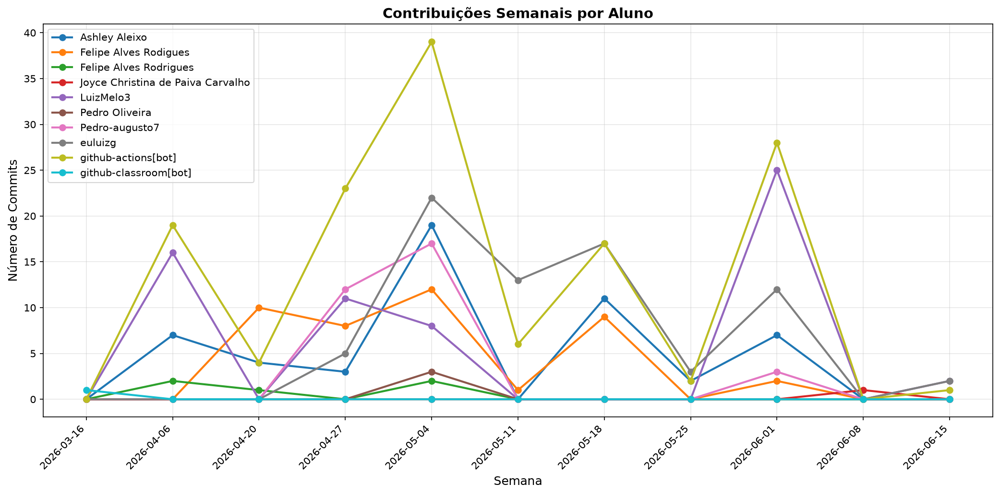

# 📊 Relatório de Contribuições do Projeto

**Última atualização:** 22/06/2026 02:33

---

## 📈 Resumo Geral de Contribuições

| Aluno                             |   Commits |   Linhas+ |   Linhas- |   Arquivos |   Docs Commits |   Docs Arquivos |
|-----------------------------------|-----------|-----------|-----------|------------|----------------|-----------------|
| Ashley Aleixo                     |        53 |      1714 |       798 |         39 |             19 |               2 |
| Felipe Alves Rodigues             |        42 |      1489 |       544 |         34 |              0 |               0 |
| Felipe Alves Rodrigues            |         5 |         3 |         3 |          1 |              2 |               1 |
| Joyce Christina de Paiva Carvalho |         1 |         2 |         2 |          1 |              0 |               0 |
| LuizMelo3                         |        62 |       495 |       345 |         23 |             51 |               3 |
| Pedro Oliveira                    |         3 |       349 |        28 |         23 |              1 |               1 |
| Pedro-augusto7                    |        32 |      1473 |      1078 |         10 |              0 |               0 |
| euluizg                           |        74 |      4891 |      2540 |        152 |              6 |               1 |
| github-actions[bot]               |       139 |       844 |       774 |          3 |            139 |               1 |
| github-classroom[bot]             |         1 |       774 |         0 |         19 |              1 |               3 |

## 📅 Contribuições Semanais (Todo o Semestre)

**2026-06-15**: LuizMelo3: 2, euluizg: 2, github-actions[bot]: 1

**2026-06-08**: Joyce Christina de Paiva Carvalho: 1

**2026-06-01**: Ashley Aleixo: 7, Felipe Alves Rodigues: 2, LuizMelo3: 25, Pedro-augusto7: 3, euluizg: 12, github-actions[bot]: 28

**2026-05-25**: Ashley Aleixo: 2, euluizg: 3, github-actions[bot]: 2

**2026-05-18**: Ashley Aleixo: 11, Felipe Alves Rodigues: 9, euluizg: 17, github-actions[bot]: 17

**2026-05-11**: Felipe Alves Rodigues: 1, euluizg: 13, github-actions[bot]: 6

**2026-05-04**: Ashley Aleixo: 19, Felipe Alves Rodigues: 12, Felipe Alves Rodrigues: 2, LuizMelo3: 8, Pedro Oliveira: 3, Pedro-augusto7: 17, euluizg: 22, github-actions[bot]: 39

**2026-04-27**: Ashley Aleixo: 3, Felipe Alves Rodigues: 8, LuizMelo3: 11, Pedro-augusto7: 12, euluizg: 5, github-actions[bot]: 23

**2026-04-20**: Ashley Aleixo: 4, Felipe Alves Rodigues: 10, Felipe Alves Rodrigues: 1, github-actions[bot]: 4

**2026-04-06**: Ashley Aleixo: 7, Felipe Alves Rodrigues: 2, LuizMelo3: 16, github-actions[bot]: 19

**2026-03-16**: github-classroom[bot]: 1

## 📊 Visualização Gráfica

## ℹ️ Observações

- **Commits**: Número total de commits realizados

- **Linhas+**: Linhas de código adicionadas

- **Linhas-**: Linhas de código removidas

- **Arquivos**: Número de arquivos únicos modificados

- **Docs Commits**: Commits em arquivos de documentação

- **Docs Arquivos**: Arquivos de documentação modificados

---

*Relatório gerado automaticamente via GitHub Actions*
